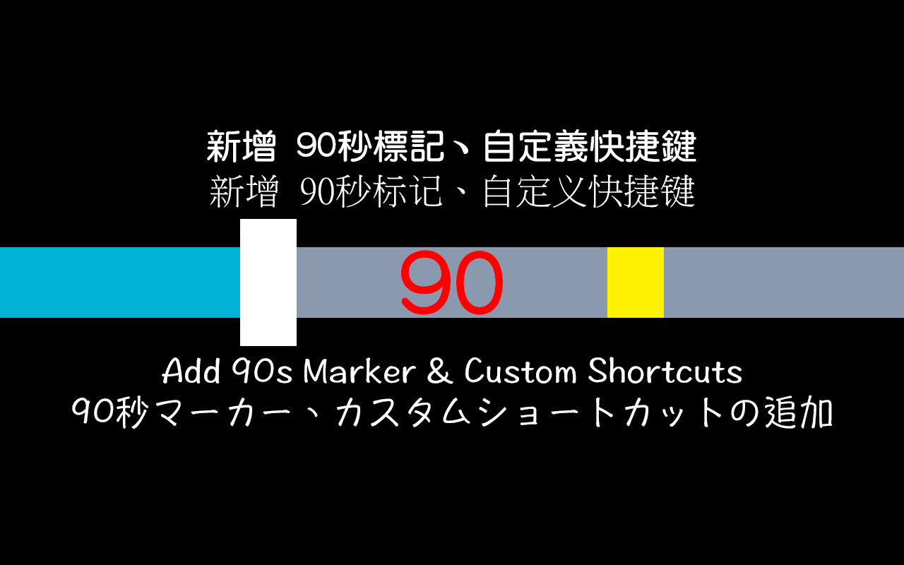

# [B.M] 動畫瘋 +90秒 進度標記

[](https://developer.chrome.com/docs/extensions/mv3/)
[](https://ani.gamer.com.tw)
[](https://github.com/BoringMan314/bm-ani-gamer-time-indicator)
[](LICENSE)

適用於 [巴哈姆特動畫瘋](https://ani.gamer.com.tw)（`ani.gamer.com.tw`）的瀏覽器擴充功能：在播放器進度條顯示「目前時間 + 90 秒」黃色標記，並提供快轉 90 秒的快捷鍵。

*在巴哈姆特动画疯（`ani.gamer.com.tw`）播放器进度条显示「当前时间 +90 秒」黄色标记，并提供快转 90 秒快捷键。*<br>
*Bahamut Anime Crazy（`ani.gamer.com.tw`）の再生バーに「現在時刻 +90 秒」の黄色マーカーを表示し、90 秒スキップのショートカットを提供します。*<br>
*Shows a +90s yellow marker on the player progress bar and provides a 90-second skip shortcut on Bahamut Anime Crazy.*

> **聲明**：本專案為第三方輔助工具，與動畫瘋／巴哈姆特官方無關。使用請遵守該站服務條款與著作權規範。

---



---

## 目錄

- [功能](#功能)
- [系統需求](#系統需求)
- [安裝方式](#安裝方式)
- [本機開發與測試](#本機開發與測試)
- [技術概要](#技術概要)
- [專案結構](#專案結構)
- [版本與多語系](#版本與多語系)
- [隱私說明](#隱私說明)
- [維護者：更新 GitHub 與 Chrome 線上應用程式商店](#維護者更新-github-與-chrome-線上應用程式商店)
- [授權](#授權)
- [問題與建議](#問題與建議)

---

## 功能

- 在播放器進度條顯示「目前時間 +90 秒」的黃色標記，幫助快速預判片頭／片尾時機，並提供快轉 90 秒的快捷鍵。
- 支援兩種快轉方式：固定單鍵 `S`（僅在未自訂擴充快捷鍵時啟用；留言輸入框內不觸發），與 `chrome://extensions/shortcuts` 可自訂命令快捷鍵（`skip90`）。
- 僅在 **`https://ani.gamer.com.tw/*`** 載入，不請求其他網站權限。

---

## 系統需求

- **Chrome** 或 **Microsoft Edge**（Chromium）等支援 **Manifest V3** 的瀏覽器。

---

## 安裝方式

### 從 Chrome 線上應用程式商店（建議）

請在 [Chrome Web Store](https://chromewebstore.google.com/) 搜尋 **「[[B.M] 動畫瘋 +90秒 進度標記](https://chromewebstore.google.com/detail/bm-%E5%8B%95%E7%95%AB%E7%98%8B-+90%E7%A7%92-%E9%80%B2%E5%BA%A6%E6%A8%99%E8%A8%98/kbhbclfechhhdeanffaoihjhpfnjcljm?hl=zh-TW)」**，或直接點選連結前往商店頁面安裝。

### 從原始碼載入（開發人員模式）

1. 點選本頁綠色 **Code** → **Download ZIP** 解壓，或 `git clone https://github.com/BoringMan314/bm-ani-gamer-time-indicator.git` 本儲存庫。
2. 開啟 Chrome 或 Edge，前往 `chrome://extensions`（Edge：`edge://extensions`）。
3. 開啟「開發人員模式」→「載入未封裝項目」→ 選取含 [`manifest.json`](manifest.json) 的專案根目錄。
4. 開啟動畫瘋任一有影片的頁面，重新整理後檢查進度條是否出現黃色標記。

---

## 本機開發與測試

修改 [`content.js`](content.js) 或 [`background.js`](background.js) 後，請在 `chrome://extensions` 針對本擴充點擊 **重新載入**，再重新整理動畫瘋分頁即可驗證變更。

---

## 技術概要

- **內容腳本** [`content.js`](content.js)：監看並綁定播放器 `<video>`，計算 `currentTime + 90` 位置更新標記；接收 `{ type: "skip90" }` 訊息執行快轉，並在未自訂命令快捷鍵時提供固定單鍵 `S`。
- **背景腳本** [`background.js`](background.js)：監聽 `chrome.commands.onCommand` 的 `skip90` 並轉發到目前分頁；以 `chrome.commands.getAll()` 判斷命令是否被自訂，控制固定單鍵是否停用。

---

## 專案結構

| 路徑 | 說明 |
|------|------|
| [`manifest.json`](manifest.json) | Manifest V3 設定、命令快捷鍵、多語系鍵值 |
| [`content.js`](content.js) | 進度條標記與頁面內快捷鍵行為 |
| [`background.js`](background.js) | `commands` 指令與快捷鍵狀態判斷 |
| [`_locales/`](_locales/) | 多語系支援（包含 `zh_TW`、`zh_CN`、`en`、`ja`） |
| [`privacy-policy.html`](privacy-policy.html) | 隱私權政策（上架商店所需之公開網頁） |
| [`icons/`](icons/) | 擴充功能圖示（16/48/128 px） |
| [`screenshot/`](screenshot/) | 商店與說明用截圖 |

**Chrome Web Store 常用截圖尺寸參考**：

| 檔案 | 用途 |
|------|------|
| `screenshot_440x280.png` | 小型宣傳圖 |
| `screenshot_1280x800.png` | 寬螢幕截圖 |
| `screenshot_1280x800.psd` | 寬螢幕截圖原始檔 (Photoshop) |
| `screenshot_1400x560.png` | 大型宣傳圖 |

---

## 版本與多語系

- **版本號**：定義於 [`manifest.json`](manifest.json) 的 `version`。
- **預設語系**：繁體中文 (`zh_TW`)。
- **多語系字串**：`_locales/*/messages.json`。

---

## 隱私說明

本擴充功能**不蒐集、不上傳**任何個人資料或瀏覽記錄；未使用任何分析工具或遠端程式碼。詳細內容請參閱 [`privacy-policy.html`](privacy-policy.html)。

**上架提醒**：提交至 Chrome Web Store 時，須於後台填寫隱私實踐聲明，並提供該政策頁面的**公開 HTTPS 網址**（建議透過 [GitHub Pages](https://pages.github.com/) 託管）。

---

## 維護者：更新 GitHub 與 Chrome 線上應用程式商店

### 更新至 GitHub

**Bash / Git Bash / PowerShell：**

```powershell
git add .
git commit -m "docs: 更新 README"
git push origin main
```

### GitHub Releases 發布說明（範本）

建立 [Releases](https://github.com/BoringMan314/bm-ani-gamer-time-indicator/releases) 時，標題建議與 `manifest.json` 的 `version` 對齊（例如 `V0.1.0`）。內文可採下列結構（格式比照 [bm-sound-effects-switch](https://github.com/BoringMan314/bm-sound-effects-switch/releases)）：

```markdown
## 首次發布

- 定位：適用於巴哈姆特動畫瘋（`ani.gamer.com.tw`）的瀏覽器擴充功能（Manifest V3），在播放器進度條顯示「目前時間 + 90 秒」黃色標記。
- 快捷鍵：未於 `chrome://extensions/shortcuts` 自訂擴充快捷鍵時，可使用單鍵 `S`（留言輸入框內不觸發）；並支援命令 `skip90`（可自訂快捷鍵，預設建議 `Ctrl+Shift+S` / Mac `Command+Shift+S`）。
- 權限：僅在 **`https://ani.gamer.com.tw/*`** 載入內容腳本，不請求其他網站權限。

## 下載

- Chrome Web Store：於商店搜尋「[B.M] 動畫瘋 +90秒 進度標記」或從 README 商店連結安裝。
- Source：GitHub 會自動提供 Source code（zip / tar.gz）。

## 備註

- 本專案為第三方輔助工具，與動畫瘋／巴哈姆特官方無關；使用請遵守該站服務條款與著作權規範。
```

### 更新至 Chrome 線上應用程式商店

請透過 [Chrome Web Store 開發人員控制台](https://chrome.google.com/webstore/devconsole) 手動上傳更新：

1. **遞增版本**：修改 `manifest.json` 中的 `version`（例如 `0.1.0` 提升至 `0.1.1`）。
2. **封裝套件**：將專案內容壓縮為 ZIP 檔。  
   - **必要檔案**：`manifest.json`, `content.js`, `background.js`, `privacy-policy.html`, `icons/`, `_locales/`。  
   - **排除檔案**：`.git/`, `.gitignore`, `screenshot/`, `README.md`, `*.psd`, `*.zip`, `*.url`。
3. **上傳審核**：在控制台選擇項目 →「套件」→「上傳新套件」。
4. **提交送審**：確認文案、截圖與隱私資訊正確後，點擊「提交送審」。

---

## 授權

本專案以 [MIT License](LICENSE) 授權。

---

## 問題與建議

歡迎透過 [GitHub Issues](https://github.com/BoringMan314/bm-ani-gamer-time-indicator/issues) 回報錯誤或提出改善建議（回報時請提供瀏覽器版本與重現步驟）。
